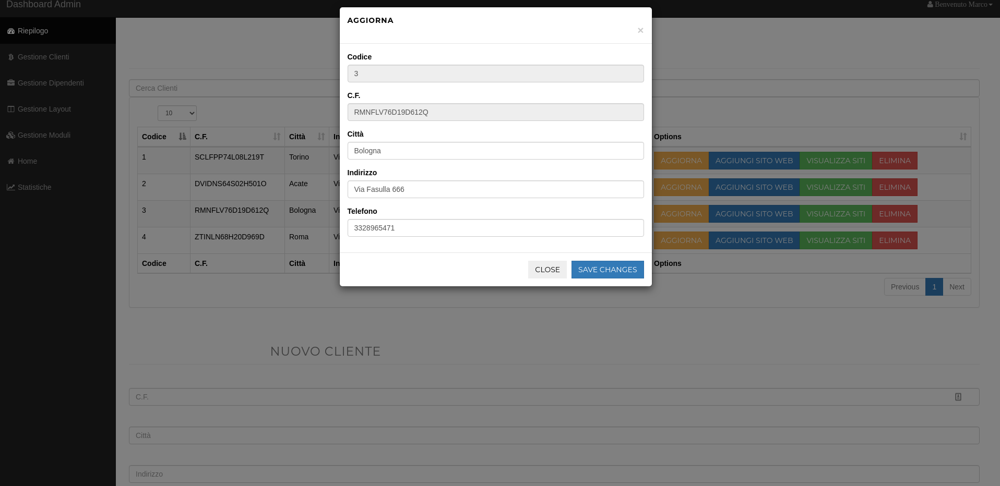
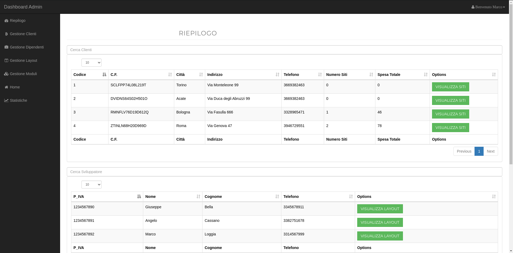
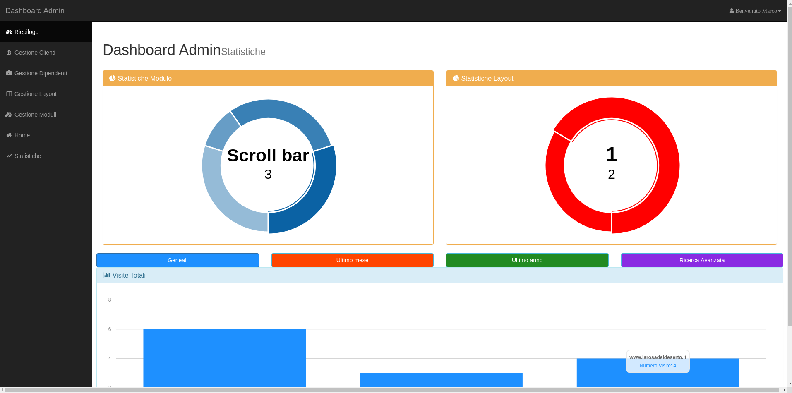
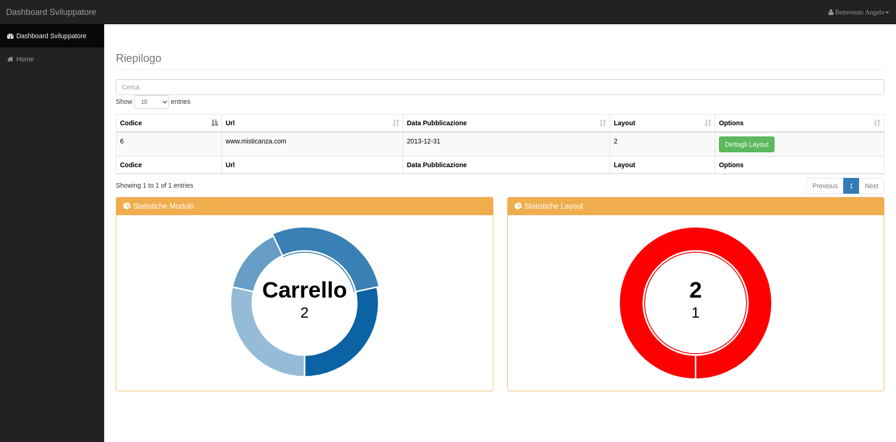
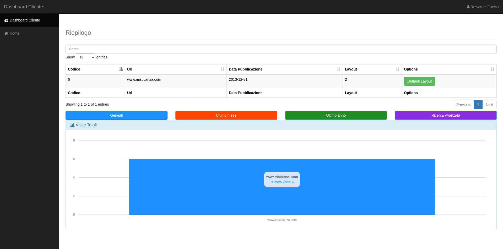

# Edge of the world


Il progetto si prefigge di implementare un gestionale per un'azienda che realizza siti web su commissione. 

Il gestionale è principalmente rivolto all'amministratore dell'azienda e implementa la maggior parte delle funzioni necessarie a gestire clienti, dipendenti e i vari siti commissionati. Ogni sito web utilizza un layout tra quelli che l'azienda offre, mentre un layout è composto da uno o più moduli i quali determinano il suo costo finale. Ogni layout è assegnato ad un solo sviluppatore. Inoltre è presente anche una sezione statistiche che mostra alcuni grafici relativi all'utilizzo dei vari moduli e dei vari layout oltre che alle visite ricevute dai vari siti web.
Tali statistiche sono presenti anche nelle dashboard con funzionalità ridotte a disposizione sia dei clienti che degli sviluppatori.

Le view relative alle diverse funzionalità sono implementate utilizzando la medesima struttura: i dati sono mostrati all'interno di tabelle *datatables* e le operazioni eseguibili associate ad ogni record sono accessibili tramite i bottoni posti nell'ultima colonna. Ogni pulsante apre una modal dove è possibile visualizzare le ulteriori informazioni oppure inserire e/o modificare i vari valori ove permesso. Anche nelle model i dati sono rappresentati tramite tabelle *datatables*.

### Esempio di modal


___
### Dashboard amministratore


### Statistiche amministratore


Le funzionalità disponibili  dalla dashboard amministratore sono:
- **Riepilogo**: mostra tre tabelle con il ripeligo di tutti i clienti, sviluppatori e layout
- **Gestione clienti**: permette di aggiungere o modificare un cliente. Inoltre è possibile associare nuovi siti web a ciascun cliente oppure visualizzare quelli già associati.
- **Gestione dipendenti**: permette di aggiungere o modificare uno sviluppatore
- **Gestione layout**: permette di definire un layout e di gestire i moduli da esso utilizzati
- **Gestione moduli**: permette di aggiungere un nuovo modulo con il relativo costo o di modificarne uno esistente
- **Statistiche**: mostra le statistiche di utilizzo dei moduli e dei layout oltre a mostrare le visite per ogni sito
___
### Dashboard sviluppatore



La dashboard sviluppatore permette di visualizzare i siti web che utilizzano un layout assegnato allo sviluppatore loggato. Sono anche disponibili le statistiche
di utilizzo dei layout assegnati oltre a quelle dei componenti da essi utilizzati.
___
### Dashboard cliente


La dashboard cliente permette di visualizzare i siti web posseduti dal cliente loggato. Sono disponibili anche le statistiche sulle visite ricevute dai vari siti web.
___

## Tecnologie utilizzate
Il backend è sviluppato utilizzando interamente php e mysql come database. Per il frontend, oltre alle tecnologie di base html, css, javascript, sono stati utilizzati i seguenti framework:
- [Bootstrap](https://getbootstrap.com) per gestire lo stile
- [JQuery](https://jquery.com/) with [AJAX](https://www.w3schools.com/js/js_ajax_intro.asp) per manipolare il DOM ed eseguire le query al backend
- [Morris.js](https://morrisjs.github.io/morris.js/) per i grafici
- [Datatables](https://datatables.net/) plugin per jQuery che permette di gestire le tabelle

Il progetto utilizza [docker](https://www.docker.com/why-docker) per realizzare due container separati su cui far girare il database mysql e l'app. La scelta di docker permette di ridurre notevolmente il tempo di deploy di un'instanza del gestionale automatizzando il processo di installazione e di configurazione dei servizi necessari alla corretta esecuzione, in questo caso Apache con modulo php per quanto riguarda il container backend-frontend, mariadb per quanto riguarda il container mysql. I due container sono collegati insieme tramite [docker-compose](https://docs.docker.com/compose/) che permette di gestire il tutto dal file **docker-compose.yml**.
___
## Dipendenze, installazione e lancio
Per eseguire l'app correttamente è necessario che nel pc siano presenti:
```
    docker
    docker-compose
```
Dopo aver clonato il repository, basta spostarsi all'interno della cartella principale ed eseguire il comando:
```
    docker-compose up
```
Per fermare i container premere **Ctrl+C**.

La landing page sarà quindi disponibile presso:
```
    http://localhost:8080
```
Da qui eseguendo il login con una delle credenziali fornite di seguito sarà possibile consultare le varie dashboard.
___
## Utenti di default:
- Marco Rossi 
```
    role: admin 
    username: marco.rossi@live.it 
    password: marcopassword
```
- Angelo Cassano
```
    role: developer 
    username: angelo.cassano@gmail.com 
    password: angelopassword 
``` 

- Flavio Romano
```
   role: user 
   username: flavioromano@live.it 
   password: flaviopassword
``` 
___
   